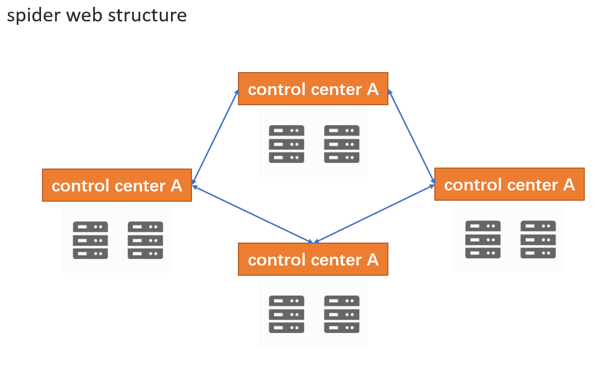

# Plantain🚢 - 易扩展的面向工业的实时库
## 简介🚲
Plantain致力于打造一个面向于工业，集实时数据集采，历史数据归档，实时数据计算及报警信息管理为一体的高性能分布式开源实时库。可实现海量实时数据的采集、存储、检索、计算和分析等功能。Plantain通过使用挂载的方式来运行，由用户二次开发的采集业务代码，来灵活的支持如Modbus、OPCUA、RS485、Https等多种通信协议。因此，Plantain具有高扩展性和高灵活配置性。

Plantain Core的开发语言：Rust; 运行环境：Docker容器;支持跨平台

## 特色功能🚛
🍓 可应对频繁变更的数据  

利用内存可高效读取数据的特性，构建高效内存数据查询算法，实现实时数据的Cache  

🍓 可将实时数据归档为历史数据，并支持对历史数据压缩  

通过配置可以启动历史归档功能，来将内存中的实时数据存储到磁盘，并且根据工业数据的特点，利用算法对历史数据进行压缩，以节约磁盘存储空间。  

🍓 丰富的处理功能  

提供报警、计算、统计分析等功能

🍓 可以分布式部署，支持多种组网方式  

Plantain可以单机运行、可以多层级以主备冗余的方式运行，也支持以网状的方式支持主备冗余的方式组网

🍓 支持组件式功能扩展和全面的采集手段支持

以类似操作系统挂载驱动的方式，加载用户开发的业务代码，赋予了Plantain更自由的功能扩展性。
- 用户可以通过挂载具有AI模型的组件，来让Plantain支持AI数据分析
- 可以通过提供摆渡组件，将Plantain中的数据摆渡到云端，从而实现在线的数据分析
- 可以挂载自己编写的采集组件，让Plantain拥有全面的数据采集能力。  
## 里程碑
Plantain   
🎉 V0.1.0  
1. Plantain可以通过驱动采集数据到实时Cache
2. 实时Cache可归档到历史数据
3. 可配置实时数据计算
4. 可配置实时计算
   
🚩 V1.0.0
1. 具备主备冗余功能
2. 具备分布式组网功能
3. 实现历史数据压缩
4. 高性能的实时流读写功能
   
## 项目开发计划 🌜
| 功能 | 状态 |
| ---- | --- |
| 需求规划 | 🌘 |
| 分布式同步核心 | 🌚 |
| 实时库核心 | 🌚 |
| 历史数据压缩 | 🌚 |
| 实时数据计算 | 🌚 |
| 报警管理 | 🌚 |
| 配置工具 | 🌚 |

## 案例说明🌰

### 智慧轨交（Plantain三层级结构部署）


### 无中心结构（Plantain网状结构部署）


## 快速开始🚀

```
docker start
```

